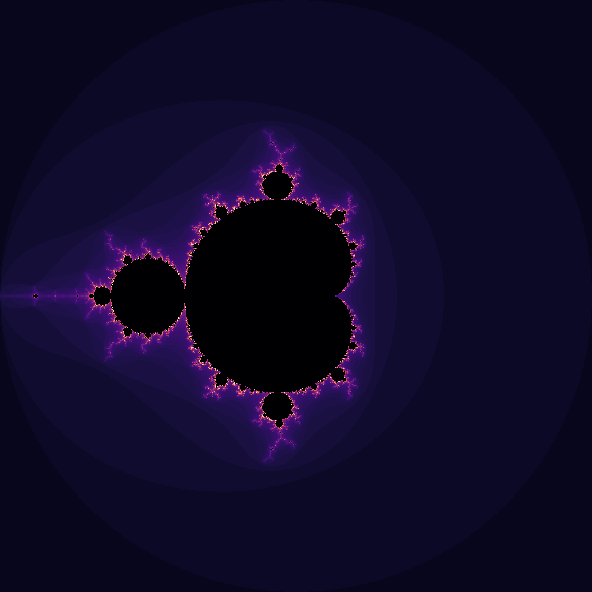

# Mandelbrot Set

## Definition
Let $f_c(z) = z^2 + c$ where $c$ be a point of the complex plane.

Let ${({u^c_{n}})}$ the sequence defined by ${u^c_n}=0$ and ${u^c_{n+1}}={f_c({u^c_n})}$ 

The Mandelbrot set is defined as the set of complex points $c$ for which $(u^c_n)$ does not diverge to infinity. 

## Implementation
It can be proven that if there is a value n for which $|u^c_n|>2$ , then the sequence diverges. 

Thus for the implementation, it is possible to loop over several points, compute several values for u^c_n, and if it is greater than 2, it is not part of the Mandelbrot set and the algorithm stops here. 

If after a large number of iteration, $|u^c_n|\leq2$, then it is assumed that the point belong to Mandelbrot set.

For each point, the number of iteration is stored in file `color.txt`

This has been implemented in `serial.c`
To run this script, run `gcc serial.c -o serial && ./serial` 

## Parallelization
As the algorithm loop over each point independently, it is embarassingly parallel. A parallelized version was implemented using MPI interface in `parallel.c`

To run this script, use the command `mpicc parallel.c -o parallel && mpirun -np 2 ./parallel`

## Display
A python script `display.py` was written using matplolib to display the colors stored in the file `color.txt`: 
